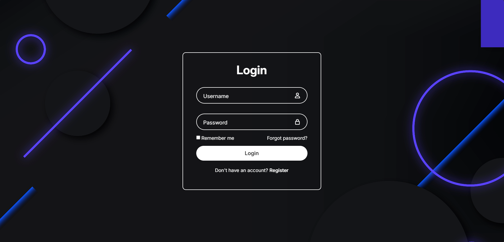

# 🎨 [Login Form in HTML & CSS](https://login-form-two-dusky.vercel.app/)



## 🔹 Sobre o projeto
Este projeto é um **formulário de login moderno** desenvolvido com **HTML** e **CSS**, focado em design elegante e experiência do usuário. O layout é centralizado, responsivo e inclui visuais como **blur** no fundo e **sombras sutis**, proporcionando um visual limpo e profissional.

Principais funcionalidade:
= Campos de **usuário** e **senha** com placeholders claros.
- Ícones integrados nos campos usando **Boxicons**.
- Checkboc para "Remember me" e link de "Forgot password".
- Botão de login estilizado com efeito hover.
- Link de registro para novos usuários.
- Fundo com imagem full-screen, mantendo proporção e centralização.

---

## ⚡ Demonstração
Para visualizar o formulário funcionando:

1. Clone o reppositório:
```bash
git clone https://github.com/UelintonHJ/login-form
```

2. Entre na pasta do projeto:
```bash
cd login-form
```

3. Abra o arquivo index.html no navegador de sua preferência.

4. O formulário estará pronto para teste e personalização.
